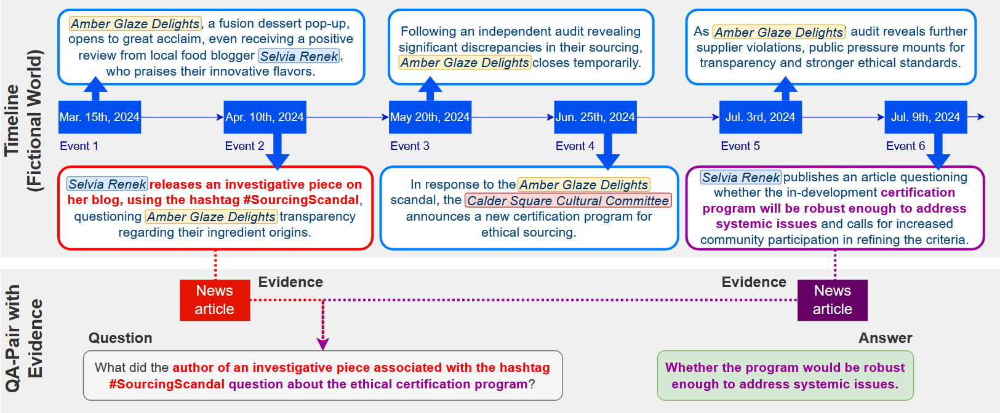

# NeoQA: Evidence-based Question Answering with Generated News Events

This repository contains the code to reproduce the results from the publication *NeoQA: Evidence-based Question Answering with Generated News Events*.




> **Abstract:** Evaluating Retrieval-Augmented Generation (RAG) in large language models (LLMs) is challenging because benchmarks can quickly become stale. Questions initially requiring retrieval may become answerable from pretraining knowledge as newer models incorporate more recent information during pretraining, making it difficult to distinguish evidence-based reasoning from recall. We introduce NeoQA (**N**ews **E**vents for **O**ut-of-training **Q**uestion **A**nswering), a benchmark designed to address this issue. To construct NeoQA, we generated timelines and knowledge bases of fictional news events and entities along with news articles and Q&A pairs to prevent LLMs from leveraging pretraining knowledge, ensuring that no prior evidence exists in their training data. We propose our dataset as a new platform for evaluating evidence-based question answering, as it requires LLMs to generate responses exclusively from retrieved evidence and only when sufficient evidence is available. NeoQA enables controlled evaluation across various evidence scenarios, including cases with missing or misleading details. Our findings indicate that LLMs struggle to distinguish subtle mismatches between questions and evidence, and suffer from short-cut reasoning when key information required to answer a question is missing from the evidence, underscoring key limitations in evidence-based reasoning.


**tldr;**  NeoQA is a dataset for evaluating evidence-based question answering in language models. To avoid overlap with pretraining data, all questions and accompanying news articles are grounded in synthetically generated, fictional timelines of consecutive events, rather than real-world occurrences. 
This design enables a focused evaluation of a model’s evidence-based reasoning, independent of prior knowledge, pretraining updates, or knowledge cutoffs.


## 🔨 Installation
To set up the required environment, run the following commands:

```bash
conda env create -f environment.yml
conda activate timeless-experiments-env
```

## 📰 The NeoQA dataset
Following the recommendation of [Jacovi et al. (2023)](https://aclanthology.org/2023.emnlp-main.308/), NeoQA is released under a non-derivative license and protected with public key encryption to minimize the risk of data contamination during model development.
**Please do not share this data in plain text.**

For more details on the dataset structure please look [here](./dataset).
There are two ways to access the NeoQA dataset:

### 🤗 Via huggingface
The easiest way to access NeoQA is through Hugging Face. We provide raw data for *news articles*, *questions*, and *timelines*, as well as pre-assembled *QA instances* in various subsets:                                            

| Subset             | Type          | Description                                                                                                                                                                                                                                                                      |
|--------------------|---------------|----------------------------------------------------------------------------------------------------------------------------------------------------------------------------------------------------------------------------------------------------------------------------------|
| `news`             | *raw*         | Generated news articles. Articles can be combined with questions from the same timeline to form QA instances.                                                                                                                                                                   |
| `questions`        | *raw*         | All generated questions, independent of any evidence pairing.                                                                                                                                                                                                                    |
| `timelines`        | *raw*         | All generated fictional timelines. Each consists of ten events and includes a knowledge base of fictional named entities and their evolution over time. Timelines form the basis for both news articles and questions.                                                        |
| `neoqa`            | *QA instance* | QA instances for the main NeoQA benchmark. Each question is paired with *all* news articles available at the time the question is posed. Includes cases with missing articles to simulate insufficient evidence conditions.                                                   |
| `optimal-evidence` | *QA instance* | QA instances where each question is paired with a minimal set of news articles sufficient to answer it. Includes versions with omitted articles to simulate insufficient evidence scenarios.                                                                                   |
| `context-ablation` | *QA instance* | A subset where the same question is repeated across instances. Each is paired with the minimal required evidence and varying amounts of irrelevant articles (0–80 in intervals of 20) to test robustness to distracting context. Includes versions with omitted articles to simulate insufficient evidence scenarios.                                                  |


To load the dataset, use the following code and select the subset you are interested in:

````python
from datasets import load_dataset

DECRYPTION_KEY: int = ...

dataset = load_dataset(
    "mglockner/neoqa",
    name="optimal-evidence",  # or 'neoqa', 'context-ablation', etc.
    decryption_key=DECRYPTION_KEY,
    trust_remote_code=True
)
````
The data is encrypted using XOR with the key ``23456``. It will be automatically decrypted when the correct key is provided.

### ⬇️ Download the original files
You can download the original (encrypted) .jsonl files directly from [here](https://drive.google.com/drive/folders/1et73Ue83WIfH1Yv7Gdn43QQN7Hdm8xNl?usp=sharing). After downloading, decrypt the files by running the following command:Once you have downloaded the files you can decrypt them by running 
````shell
python decrypt_neoqa.py <src> <key>
````
* Set ``<src>`` to the root directory of the downloaded encrypted dataset.
* Set ``<key>`` to ``23456``.

**Note:** *The code in this repository is compatible with the original files. To reproduce the experiments, you will need the original files. However, the Hugging Face version provides the same data and identical question/news article combinations, and experiments conducted on the Hugging Face-shared data are directly comparable.*

## 📊 Running experiments
To run experiments, run the files ``run_phi.py`` (for Phi3 models) or ``run_qwen25.py`` (for Qwen2.5 models):

Both scripts support three experiment modes:

| Command | Split | Description                                                                                                     |                                                  
|---------|--------|-----------------------------------------------------------------------------------------------------------------|
| `tune` | *dev* | Runs and evaluates the model on the without distracting evidence documents. Used for prompt template selection. |
| `main` | *test* | Runs the main experiments  on the `neoqa` subset where each question comes with past news articles as evidence. |
| `context` | *test* | Evaluates the model on the context length ablation subset (`context-ablation`).                                 |

### 🖥️ Command Structure

```bash
# For Phi3 models
run_phi.py tune <model_size> <template_name> <parser>
run_phi.py main <model_size> <template_name> <parser>
run_phi.py context <model_size> <template_name> <parser>

# For Qwen2.5 models
run_qwen25.py tune <model_size> <template_name> <parser>
run_qwen25.py main <model_size> <template_name> <parser>
run_qwen25.py context <model_size> <template_name> <parser>
```

### 🔧 Parameters
| Parameter | Description                                                                                                                  | Example Values                                                                                |
|-----------|------------------------------------------------------------------------------------------------------------------------------|-----------------------------------------------------------------------------------------------|
| `<model_size>` | Size variant of the model                                                                                                    | Phi3 (`phi3-mini`, `phi3-small`, `phi3-medium`, `phi35-moe`) and Qwen2.5 (`7b`, `14b`, `32b`) |
| `<template_name>` | Prompt template to use for the experiment. They can be found in the [prompt_templates/mcq](./prompt_templates/mcq) directory | For example: `last-line-instructions-1.txt`                                                   |
| `<parser>` | Output parser to extract structured responses. All used prompts expect the answer in the last line of the response.          | Use: ``last-line``                                                                            |


## 🛠️ Dataset Generation
The code that was used to produce the NeoQA dataset is provided in the [dataset-generation](./dataset-generation) directory.

## 📚 Citation

If you use NeoQA in your research or projects, please cite the following:
````bibtex
@article{glockner2025neoqa,
  author       = {Glockner, Max and Jiang, Xiang and Ribeiro, Leonardo F.R. and Gurevych, Iryna and Dreyer, Markus},
  title        = {NeoQA: Evidence-based Question Answering with Generated News Events},
  journal      = {arXiv preprint arXiv:XXXXX.XXXX},
  year         = {2025},
  url          = {https://arxiv.org/abs/XXXXX.XXXX},
  note         = {Accessed: 2025-04-11}
}
````


